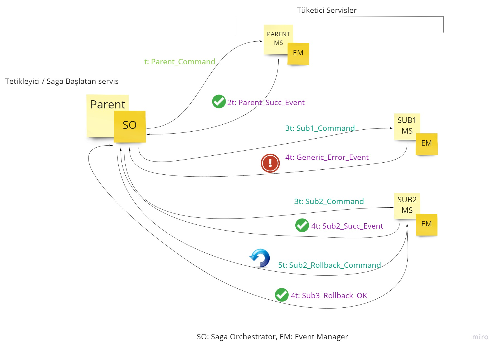

# Serüvenn : Event Driven - Async-first - Saga Orkestrasyonlu Mikroservis Çatısı

Geliştirmesi hâlâ devam ediyor !!!

Serüvenn, bir Mikroservis çatı kütüphanesidir. Asenkron-öncelikli (Async-first) mikroservis dünyasının ACID transaction problematiğine getirilen Orkestrasyon tipi Saga işleyicisi ve bu Saga Orchestrator'a event gönderen "Tüketici" mikroservisleri şablonunu içeren bir çalışmadır. 

Saga Orkestraonu için referans bilgi için: 
https://blog.couchbase.com/saga-pattern-implement-business-transactions-using-microservices-part-2/

Klasik saga orkestratörü, Tetikleyici mikroservise eklenerek (Chris Richardson tanımındaki gibi) tetikleyici akış için hazırlanır.

## Akış genel olarak
1. Tetik servisi içinde embed olan SagaOrchestrator ile tetik Command'lerini atar.
2. Tüketici mikroservisler bu Command'leri yakalar; iş mantıklarını çalıştırır ve sonuç olarak bir Event fırlatır.
3. Bu event'ler filtreli bir şekilde sadece SagaOrchestrator tarafından dinlenir. 
4. SagaOrchestrator gelen başarılı veya rollback gerektiren Event'ler için DB'de dinamik tutulan bir veya birden fazla sub-Command setini çalıştırır.
5. Başarısız tüketici mikroservisler jenerik hata event'leri fırlatır ve SagaOrchestrator başarılı çalışmış tüm mikroservislere rollback komutlarını dağıtır.
6. Herhangi bir sub-command kalmayana ve SagaOrchestrator tüm başarılı veya rollback_başarılı eventleri toplayana kadar Saga devam eder.

###Başarılı Akış


###Rollback Akışı



## Varsayımlar:
1. Bir command bir Saga içerisinde bir kere çalışması kabul edilmiştir.
2. SagaOrchestrator'a ulaşan bir Event için birden fazla Command çalıştırılabilir.
3. SagaOrchestrator Command'leri tek tek event'lere göre fırlatır.
4. Event'lerin dinlenmesi ise her event bazında filter edilmiş şekilde Rollback eventleri ile LeftJoin olarak dinlenir. Bunun anlamı şudur: Bir event'in örneğin START_OF_ORDER_SUCCESSFUL event'inin yalnız başına geldiği bir timewindow'da Success Command'lerini çalıştırabilmek ve aynı zamanda START_OF_ORDER_SUCCESSFUL + GENERIC_ERROR gibi bir join olduğunda bir Rollback Command başlatılması gerekmektedir.
5. Kafka'ya atılan Event mesajları içinde Command ve Event'ler bir arada bulunur. 
6. Kafka'ya atılan Event'ler içinde custom taşınan nesneler CarrierEntity alanında tutulur. Bu alana gelecek objelerin KafkaMessageInnerEntity sınıfını extend etmesi gerekecektir. Kod geliştiriciyi buna zorlayacaktır
7. CarrierEntity alanında gönderilen her taşıyıcı obje için DB'ye (Mysql) kayıt gerekmektedir. Command ve Event için ayrı tablolar bulunmaktadır.
8. Buradaki Saga Orchestrator routing işlemini dinamik olarak yapar. Eğer gelen her event'te custom bir çok aksiyon almak istiyorsanız, bu framework amacınıza uygun değildir.
9. SagaOrchestrator rollback anını yakalamak için herhangi bir servisten GENERIC_ERROR hatasının atılmasını sabit bir şekilde bekler.
10. Mevcut Serüvenn halen geliştirme aşamasındadır. Katkılarınızla daha da iyi konuma gelecektir.
11. Commons projesi birçok veritabanı nesnesi, taşıyıcı obje ve Saga kodları izini taşımaktadır. 
12. Bu çatıyı kullanan geliştiricilerin Commons projesinde Parent, Sub1, Sub2 vb isimlerle anılan Command ve Event nesnelerini kendi iş ihtiyaçlarına göre CommandType, EventType nesnelerini güncellemeleri gerekmektedir.
13. Kafka mesajları (Command veya Event) içinde gidip gelen nesnelerin Commons projesinde Carriers paketi altına aktarılması gerekmektedir.
14. İş ihtiyacına göre birden fazla Saga akışı olabileceği için (örneğin şikayet akışı Saga'sı, alışveriş sepeti Saga'sı gibi gibi...) Commons altındaki SagaCodes sınıfına veritabanındaji Saga kodlarının sync edilmesi gerekmektedir. Dinamik bir şekilde almak üzere burası geliştirilebilir.


## Veri Modeli


SAGA: Bir iş alanında örneğin bir e-ticaret sitesinde hem Sipariş Saga'sı hem İade Saga'sı vb bir çok Saga olabileceği için tanım dinamik bir şekilde Saga tablosunda tutulur. 

SAGA_STATE: Saga altındaki adımların tutulduğu tablodur. Her bir event'e karşılık gelen Success path adımları Reverse_Command=0 olacak şekilde tutulur. O event'e ait Rollback adımı ise, aynı adım tablosunda Reverse_Command=1 olacak şekilde tutulur. Bir event'te birden fazla Command çıkabileceği için ve bir Saga'da bir Command bir kez yazılacağı varsayıldığı için constraint SagaID + CommandType üzerine kurulmuştur.

COMMAND_TYPE_CLASS_NAME: Saga'nın ürettiği her bir Command içinde gönderilebilecek yegane Taşıyıcı nesnenin uzun paket+sınıf adı eşleşmesi içerir. Örneğin: SiparisCommand -> com.x.y.Siparis gibi...

EVENT_TYPE_CLASS_NAME: Tüketici mikroservislerin ürettiği her bir Event içinde gönderilebilecek yegane Taşıyıcı nesnenin uzun paket+sınıf adı eşleşmesi içerir. Örneğin: SiparisSuccessfulEvent-> com.x.y.Siparis gibi...

HIBERNATE_SEQUENCE: Silmeyin!!! Hibernate'in sequence sırasını tutmak için oluşturduğu otomatik tablodur.


## Örnek uygulama

//FIXME burası IaaC moduna (container, orchestrator, playbook) dönüştürülebilir. Henüz geliştirme aşamasında !!

Kod içerisine tetikten (1) ve tüketmekten sorumlu (4) mikroservis için örnek verilmiştir. 
Bu örnekte Parent_command çalıştıktan sonra Sub1, Sub2 ve Sub3 Command'leri aynı anda tetiklenecek ve bir fan-out denemesi yapılabilecektir.
Mevcut çalıştırma ile Success path'i çalışacaktır. Rollback denemesi yapıp, tüm işlem geçirmiş servislerin teker teker nasıl Rollback komutları aldığını görmek için herhangi bir SubX listener mikroservis seçilip, SUCCESSFUL event'i yerine GENERIC_ERROR event'i atması sağlanarak rollback gözlemlenebilir. 


### AWS üzerinde veya Ubuntu temelinde Serüvenn Örnek Kurulumu

### MySQL

Ubuntu 18.04 HVM
t2.small (1x2)
security tüm portlar açık (prod'da tabii ki bunu yapmayın plz)
disk 8gb SSD general purpose
userdata alanı aşağıdaki gibi:

```
#!/bin/bash
sudo apt-get update
sudo apt-get -y install mysql-server
echo "Updating mysql configs in /etc/mysql/mysql.conf.d/mysqld.cnf."
sudo sed -i "s/.*bind-address.*/bind-address = 0.0.0.0/" /etc/mysql/mysql.conf.d/mysqld.cnf
echo "Updated mysql bind address in /etc/mysql/mysql.conf.d/mysqld.cnf to 0.0.0.0 to allow external connections."
sudo systemctl restart mysql
```

Running modda çalıştığını görüp SSH ile bağlandıktan sonra:
```
sudo mysql
```
gelen mysql client ekranında aşağıdaki komutlar tek tek çalıştırılır:
```
CREATE USER 'root'@'%' IDENTIFIED BY 'root';
GRANT ALL PRIVILEGES ON *.* TO 'root'@'%' WITH GRANT OPTION;
ALTER USER 'root'@'%' IDENTIFIED WITH mysql_native_password BY '[APP_MYSQL_PASSWORD]';
GRANT ALL PRIVILEGES ON *.* TO 'root'@'%' IDENTIFIED BY '[APP_MYSQL_PASSWORD]' WITH GRANT OPTION;
FLUSH PRIVILEGES;
```

Köşeli parantezli kısmı kendi şifrenizle değiştirmelisiniz.
(Köşeli parantez kalmayacak ama tırnak işaretleri kalacak)
bu şifreyi aşağıdaki IDE ayarlarında koda gömüyor olacaksınız; o yüzden lütfen kaydedin
mysql client'tan çıkmak için exit komutu kullanılabilir

en son: 
```
sudo systemctl restart mysql
```

ve sonrasında:
```
sudo systemctl status mysql
```
ile mysql servisinin Active durumda olduğu kontrol edilir...
Active olarak gözükmüyor veya Stopped durumda ise 
sudo journalctl ile logları kontrol etmek gerekir

bu noktadan sonra AWS'nin verdiği IPv4 ip'si ile bir Mysql Client uygulaması ile (örneğin HeidiSQL) root kullanıcısı ve [APP_MYSQL_PASSWORD] yerine yazdığınız şifre ile girip veritabanına ulaşabilirsiniz. Bağlandıysanız: [APP_DB_NAME] yerine geçebilecek bir Db adı ile bir veritabanı oluşturmanuz gerekir. HeidiSQL'de sağ tıkla yapabilirsiniz...


### KAFKA

Ubuntu 18.04 HVM
t2.xlarge (4x16)
security tüm portlar açık (prod'da tabii ki bunu yapmayın plz)
disk 20gb SSD general purpose
userdata alanı aşağıdaki gibi, hiçbir şey değiştirmeden:

```
#!/bin/bash
sudo apt-get update
sudo apt-get -y install docker.io
sudo docker run -d --net=host -e ADV_HOST=$(curl http://169.254.169.254/latest/meta-data/public-ipv4) lensesio/fast-data-dev
```

bu komuttan birkaç dakika sonra sonra AWS'nin bu sunucu için atadığı IPv4 ip'sine :3030 portunu ekleyerek fast-data-dev Kafka UI ekranına giriş yapabilirsiniz

```
[APP_KAFKA_GLOBAL_TOPIC_IP]:3030
```


Kafka makinesine SSH ile bağlandıktan sonra:

```
sudo docker ps 
```

ile Kafka container adını alıp;

```
sudo docker exec -it [kafka_container_adı] bash
```

dedikten sonra gelen konsolda ([APP_KAFKA_GLOBAL_TOPIC_NAME] yerine istediğiniz bir topic adı):

```
kafka-topics --create --topic [APP_KAFKA_GLOBAL_TOPIC_NAME] --bootstrap-server localhost:9092 --replication-factor 1 --partitions 1
```

diyerek global topic'i oluşturabilirsiniz

artık [APP_KAFKA_GLOBAL_TOPIC_IP]:3030 adresine tarayıcıdan gidip, Topics alanına baktığınızda Topic listesinde [APP_KAFKA_GLOBAL_TOPIC_NAME] yerine koyduğunuz topic adını göreceksiniz. Üstüne tıklayarak üzerindeki mesajları görebilirsiniz


### KOD DEĞİŞİKLİKLERİ

Favori editörünüz nedir bilmem ama bizde STS var. CTRL+Shift+R -> "*.properties" filtresi ile 6 properties dosyasını açıp her dosyada aşağıdaki property'leri doğrularıyla değiştirmeniz gerekiyor:

[APP_MYSQL_IP] -> buraya yukarıdaki MySQL sunucusu public IPv4 ip'si
[APP_DB_NAME] -> seçtiğiniz veritabanı adı
[APP_MYSQL_PASSWORD] -> seçtiğiniz veritabanı şifresi
[APP_KAFKA_GLOBAL_TOPIC_NAME] -> Kafka global topic için seçtiğiniz isim
[APP_KAFKA_GLOBAL_TOPIC_IP] -> buraya yukarıdaki Kafka sunucusu public IPv4 ip'si

Eclipse türevi kullanıyorsanız, bi Project -> Clean All iyi olacaktır değil mi, malum daha bir parent pom yazmadık :)


### ÇALIŞTIRMA

DemoTriggerMS ve DemoConsumerMS projeleri geliştirici bilgisayarında Spring Boot projesi olarak başlatılabilir. Böylelikle JPA, [APP_DB_NAME] ismi ile anılan veritabanı üzerine ilgili tabloları DDL update ile oluşturur. 


### DB ÖRNEK AKIŞ YÜKLEME

Bundan sonra aşağıdaki komutlar Mysql üzerinde çalıştırılır. HeidiSQL veya bir Mysql client veya Mysql sunucusu üzerinde "sudo mysql" çalıştırarak girilen client'ta bu dosya komutları çalıştırılabilir. Bu adım gerçekleşmezse örnek veri olmadığı için "Saga Bulunamadı" gibi hatalarla karşılaşabilirsiniz. Ki bu çok doğal... Çünkü içeride bir çok şey dinamik tanımlanıyor

```
INSERT INTO saga (id, kod, STATUS) VALUES (996, "111", 1);

INSERT INTO saga_state (id, command_type, reverse_command, saga_id)
VALUES (995, "PARENT_COMMAND", 0, 996);
INSERT INTO saga_state (id, command_type, event_type, reverse_command, saga_id)
VALUES (996, "SUB1_COMMAND", "PARENT_SUCCESSFUL", 0, 996);
INSERT INTO saga_state (id, command_type, event_type, reverse_command, saga_id)
VALUES (997, "SUB2_COMMAND", "PARENT_SUCCESSFUL", 0, 996);
INSERT INTO saga_state (id, command_type, event_type, reverse_command, saga_id)
VALUES (998, "SUB3_COMMAND", "PARENT_SUCCESSFUL", 0, 996);

INSERT INTO saga_state (id, command_type, event_type, reverse_command, saga_id)
VALUES (1000, "PARENT_ROLLBACK_COMMAND", "PARENT_SUCCESSFUL", 1, 996);
INSERT INTO saga_state (id, command_type, event_type, reverse_command, saga_id)
VALUES (1001, "SUB1_ROLLBACK_COMMAND", "SUB1_SUCCESSFUL", 1, 996);
INSERT INTO saga_state (id, command_type, event_type, reverse_command, saga_id)
VALUES (1002, "SUB2_ROLLBACK_COMMAND", "SUB2_SUCCESSFUL", 1, 996);
INSERT INTO saga_state (id, command_type, event_type, reverse_command, saga_id)
VALUES (1003, "SUB3_ROLLBACK_COMMAND", "SUB3_SUCCESSFUL", 1, 996);

INSERT INTO command_type_class_name (id, class_name, command_type)
VALUES (995, "com.ikite.seruvenn.Commons.carriers.Foo", "PARENT_COMMAND");
INSERT INTO command_type_class_name (id, class_name, command_type)
VALUES (996, "com.ikite.seruvenn.Commons.carriers.Foo", "SUB2_COMMAND");
INSERT INTO command_type_class_name (id, class_name, command_type)
VALUES (997, "com.ikite.seruvenn.Commons.carriers.Foo", "SUB1_COMMAND");
INSERT INTO command_type_class_name (id, class_name, command_type)
VALUES (998, "com.ikite.seruvenn.Commons.carriers.Foo", "SUB3_COMMAND");

INSERT INTO command_type_class_name (id, class_name, command_type)
VALUES (1000, "com.ikite.seruvenn.Commons.carriers.Foo", "PARENT_ROLLBACK_COMMAND");
INSERT INTO command_type_class_name (id, class_name, command_type)
VALUES (1001, "com.ikite.seruvenn.Commons.carriers.Foo", "SUB2_ROLLBACK_COMMAND");
INSERT INTO command_type_class_name (id, class_name, command_type)
VALUES (1002, "com.ikite.seruvenn.Commons.carriers.Foo", "SUB1_ROLLBACK_COMMAND");
INSERT INTO command_type_class_name (id, class_name, command_type)
VALUES (1003, "com.ikite.seruvenn.Commons.carriers.Foo", "SUB3_ROLLBACK_COMMAND");


INSERT INTO event_type_class_name (id, class_name, event_type)
VALUES (995, "com.ikite.seruvenn.Commons.carriers.Foo", "PARENT_SUCCESSFUL");
INSERT INTO event_type_class_name (id, class_name, event_type)
VALUES (996, "com.ikite.seruvenn.Commons.carriers.Foo", "SUB2_SUCCESSFUL");
INSERT INTO event_type_class_name (id, class_name, event_type)
VALUES (997, "com.ikite.seruvenn.Commons.carriers.Foo", "SUB1_SUCCESSFUL");
INSERT INTO event_type_class_name (id, class_name, event_type)
VALUES (998, "com.ikite.seruvenn.Commons.carriers.Foo", "SUB3_SUCCESSFUL");

INSERT INTO event_type_class_name (id, class_name, event_type)
VALUES (1004, "com.ikite.seruvenn.Commons.carriers.Foo", "GENERIC_ROLLBACK");

INSERT INTO event_type_class_name (id, class_name, event_type)
VALUES (1000, "com.ikite.seruvenn.Commons.carriers.Foo", "PARENT_ROLLBACK_OK");
INSERT INTO event_type_class_name (id, class_name, event_type)
VALUES (1001, "com.ikite.seruvenn.Commons.carriers.Foo", "SUB2_ROLLBACK_OK");
INSERT INTO event_type_class_name (id, class_name, event_type)
VALUES (1002, "com.ikite.seruvenn.Commons.carriers.Foo", "SUB1_ROLLBACK_OK");
INSERT INTO event_type_class_name (id, class_name, event_type)
VALUES (1003, "com.ikite.seruvenn.Commons.carriers.Foo", "SUB3_ROLLBACK_OK");
```


### EN SON

İlk tetik denemesi için localhost:9098/dene adresinden tetik yapılabilir.

### SONUÇ

